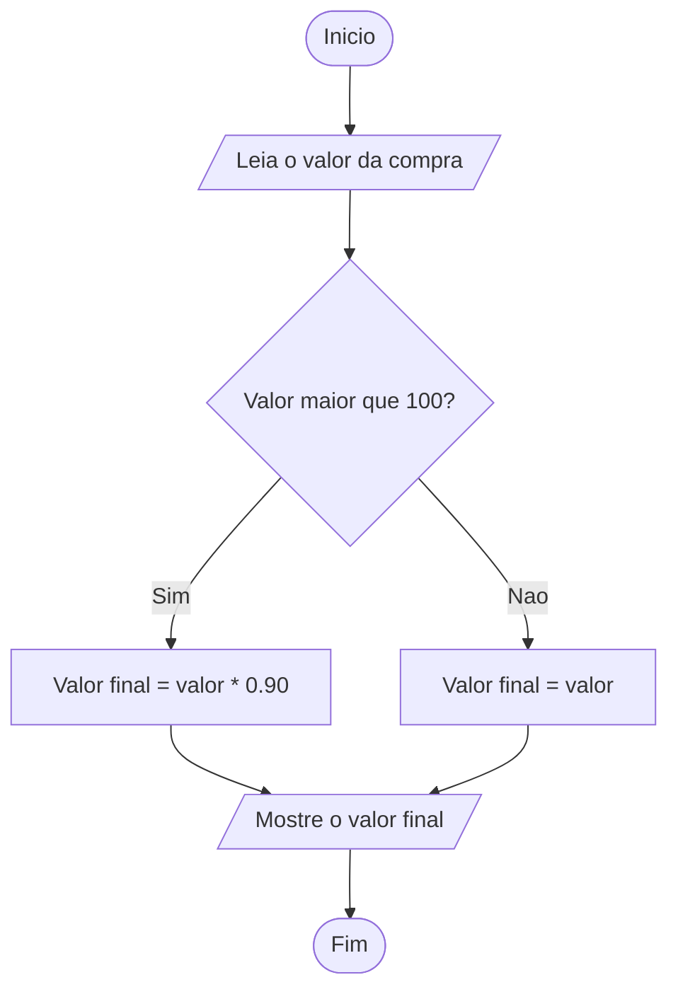

```mermaid
flowchart TD
    A([Inicio]) --> B[/Leia o valor da compra/]
    B --> C{Valor maior que 100?}
    C -- Sim --> D[Valor final = valor * 0.90]
    C -- Nao --> E[Valor final = valor]
    D --> F[/Mostre o valor final/]
    E --> F
    F --> G([Fim])
```
